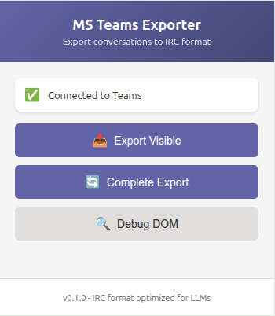

# MS Teams Chat Exporter

Chrome extension to export Microsoft Teams Web conversations to IRC-style plain text format, optimized for LLM ingestion.



## 🎯 Features

- ✅ **Two export modes**: Visible (fast) or Complete (auto-scroll)
- ✅ **Intelligent auto-scroll**: Automatically loads all old messages
- ✅ Export Teams Web conversations to IRC format
- ✅ Extracts: author, timestamp, content, attachments, and reactions
- ✅ Format optimized for LLM analysis
- ✅ Simple and easy-to-use interface
- ✅ Debug button to verify selectors

## 📋 Requirements

- Google Chrome or Chromium-based browser
- Microsoft Teams account with access to conversations

## 🚀 Installation

### 1. Clone or download the repository

### 2. Load the extension in Chrome

1. Open Chrome and navigate to `chrome://extensions/`
2. Enable **Developer mode** (top right corner)
3. Click **Load unpacked**
4. Select the directory `/home/devnix/dev/devnix/msteams-exporter`

The extension should now appear in your extensions list.

## 📖 Usage

### 1. Navigate to a Teams conversation

1. Open [Microsoft Teams Web](https://teams.microsoft.com) in Chrome
2. Navigate to a channel or conversation you want to export
3. Make sure messages are visible on screen

### 2. Open the extension

1. Click the extension icon in Chrome's toolbar
2. You should see the message: **"Connected to Teams"** ✅

### 3. Export the conversation

You have **two export modes**:

#### 📥 Export Visible (Fast)

**For short conversations or recent messages**

1. Click **"Export Visible"**
2. Wait 1-2 seconds
3. Click **"Download File"**

✅ **Fast**: Only exports currently visible messages
❌ **Limited**: Does not load old messages

#### 🔄 Complete Export (Auto-Scroll)

**For long conversations - RECOMMENDED**

1. Click **"Complete Export"**
2. Watch the auto-scroll load old messages
3. Wait for completion (10-60 seconds)
4. Click **"Download File"**

✅ **Complete**: Exports ALL messages from history
✅ **Automatic**: Scrolls and loads old messages
⏱️ **Slower**: Takes longer for long conversations

> 💡 **Tip**: For conversations with >50 messages, always use "Complete Export"

#### Option C: Debug first (optional)

1. Click **"Debug DOM"**
2. Verify messages are detected correctly
3. Then proceed with export

## 📄 Output format

The exported file uses IRC format:

```
================================================================================
MS Teams - Project Planning Q1 2026
Exported: 2026-02-10 17:30:45
Total messages: 32
Format: IRC (optimized for LLMs)
================================================================================

[2026-02-09 11:39:00] === Project Planning Q1 2026 ===
[2026-02-09 11:39:00] <Alice Johnson> Hello @Team,
[2026-02-09 11:39:00]   The kickoff meeting is scheduled for tomorrow at 10:00 AM
[2026-02-09 11:39:00] 👍
[2026-02-10 12:01:00] <Alice Johnson> Meeting started successfully
[2026-02-10 12:03:00] <Bob Smith> All systems running smoothly
[2026-02-10 12:05:00] <Charlie Davis> Great! Added notes to the document

================================================================================
End of conversation
================================================================================
```

### Format elements

- `[YYYY-MM-DD HH:MM:SS]` - Timestamp
- `<Author>` - Author name
- `@Mention` - Single-word mention
- `@<Full Name>` - Multi-word name mention
- `===Title===` - Message subject (if exists)
- `👍😂❤️` - Reactions as emojis
- `[ATTACHMENT: name]` - File attachments
- `[EDITED]` - Edited message

## 🔧 Project structure

```
msteams-exporter/
├── manifest.json           # Extension configuration
├── popup/
│   ├── popup.html         # User interface
│   ├── popup.css          # Styles
│   └── popup.js           # UI logic
├── content/
│   └── content.js         # Script injected in Teams
├── background/
│   └── background.js      # Service worker
├── lib/
│   ├── utils.js           # General utilities
│   ├── extractor.js       # DOM extraction
│   └── formatter.js       # IRC formatting
├── icons/                 # Extension icons
└── README.md
```

## 🐛 Troubleshooting

### Extension doesn't connect to Teams

- **Solution**: Make sure you're on `teams.microsoft.com` or `teams.cloud.microsoft`
- Reload the Teams page

### No messages extracted

1. Click **"Debug DOM"**
2. Check the popup console (F12) for errors
3. Make sure messages are visible on screen
4. If Teams updated its interface, selectors may need updating

### Timestamps are not correct

- The extension extracts timestamps as they appear in Teams ("Yesterday 11:39", "12:01", etc.)
- For absolute timestamps, Teams would need to provide the `datetime` attribute

## 🔍 DOM Selectors

Selectors were verified on **2026-02-10** with Teams Web:

```javascript
const SELECTORS = {
  messageItem: '[data-tid="channel-replies-pane-message"]',
  threadTitle: 'h2[id^="subject-line"]',
  author: 'span.fui-StyledText',
  timestamp: 'time',
  messageBody: '[data-tid="message-body"]',
  reactions: '[data-tid="channel-message-reaction-summary"]'
};
```

If Teams updates its interface, these selectors may need adjustment.

## 📝 Limitations

- **Only works with Teams Web** (not desktop app)
- **Requires login** - extension does not handle authentication
- **Only visible messages**: Extracts messages currently in the DOM
  - For long conversations, scrolling may be necessary
- **No access to deleted messages**
- **Dependent on Teams UI**: May break with updates

## 🔄 Future improvements

- [x] ✅ Auto-scroll to load old messages **(IMPLEMENTED v0.2.0)**
- [ ] Animated progress bar during auto-scroll
- [ ] Pause/Resume during long exports
- [ ] Filter by date
- [ ] Filter by author
- [ ] Support for nested reply threads
- [ ] Better individual reaction parsing
- [ ] Download file attachments
- [ ] Support for direct chats (not just channels)

## 📜 License

MIT License

Copyright (c) 2026 MS Teams Chat Exporter Contributors

Permission is hereby granted, free of charge, to any person obtaining a copy
of this software and associated documentation files (the "Software"), to deal
in the Software without restriction, including without limitation the rights
to use, copy, modify, merge, publish, distribute, sublicense, and/or sell
copies of the Software, and to permit persons to whom the Software is
furnished to do so, subject to the following conditions:

The above copyright notice and this permission notice shall be included in all
copies or substantial portions of the Software.

THE SOFTWARE IS PROVIDED "AS IS", WITHOUT WARRANTY OF ANY KIND, EXPRESS OR
IMPLIED, INCLUDING BUT NOT LIMITED TO THE WARRANTIES OF MERCHANTABILITY,
FITNESS FOR A PARTICULAR PURPOSE AND NONINFRINGEMENT. IN NO EVENT SHALL THE
AUTHORS OR COPYRIGHT HOLDERS BE LIABLE FOR ANY CLAIM, DAMAGES OR OTHER
LIABILITY, WHETHER IN AN ACTION OF CONTRACT, TORT OR OTHERWISE, ARISING FROM,
OUT OF OR IN CONNECTION WITH THE SOFTWARE OR THE USE OR OTHER DEALINGS IN THE
SOFTWARE.

## 👨‍💻 About

Developed as a tool to facilitate Teams conversation analysis with LLMs.

---

**Last updated**: 2026-02-10
**Version**: 0.1.0
**Status**: Initial Release
